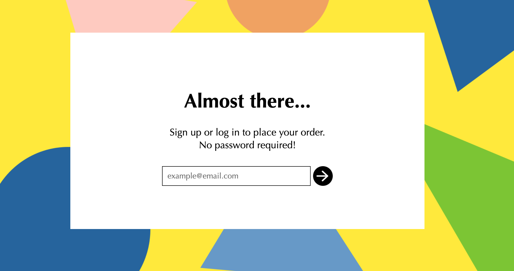

# stytch-node-magic-links

This example app uses the [Stytch API](https://stytch.com/docs/api) and backend Node SDK to demonstrate a quick Stytch implementation using our [Email Magic Links](https://stytch.com/docs/guides/magic-links/email-magic-links/api) product.

<p align="center">
  
</p>

# Running locally

## Set up

### In the Stytch Dashboard
1. Create a [Stytch](https://stytch.com/) account. Once your account is set up a Project called "My first project" will be automatically created for you.

2. Navigate to [Redirect URLs](https://stytch.com/dashboard/redirect-urls), and add `http://localhost:3000/authenticate` (the `PORT` set in `.env`) as the types **Login** and **Sign-up**.

3. Finally, navigate to [API Keys](https://stytch.com/dashboard/api-keys), and copy your `project_id` and `secret`. You will need these value later on.

### On your machine

In your terminal, clone the project and install dependencies:

```bash
git clone https://github.com/stytchauth/stytch-node-magic-links.git
cd stytch-node-magic-links
npm i
```

Next, fill in `STYTCH_PROJECT_ID` and `STYTCH_SECRET` in the `.env` file with the credentials retrieved in step 3 above. 

## Running the app

After completing all the set up steps above the application can be run with the command:

```npm start```

The application will be available at [`http://localhost:3000`](http://localhost:3000) and you'll be able to login with Email Magic Links! 

To do so, enter your email, then check for the Stytch email and click the sign in button.

You should be signed in!
## Next steps

This example app showcases a small portion of what you can accomplish with Stytch. Here are a few ideas to explore:

1. Add additional login methods like [Passwords](https://stytch.com/docs/guides/passwords/api) or [Passcodes](https://stytch.com/docs/guides/passcodes/api).
2. Use [Stytch Sessions](https://stytch.com/docs/sessions) to secure your backend.
3. Secure your app further by building MFA authentication using methods like [WebAuthn](https://stytch.com/docs/guides/webauthn/api).


## Get help and join the community

#### :speech_balloon: Stytch community Slack

Join the discussion, ask questions, and suggest new features in our ​[Slack community](https://join.slack.com/t/stytch/shared_invite/zt-nil4wo92-jApJ9Cl32cJbEd9esKkvyg)!

#### :question: Need support?

Check out the [Stytch Forum](https://forum.stytch.com/) or email us at [support@stytch.com](mailto:support@stytch.com).


1. Fill in `STYTCH_PROJECT_ID` and `STYTCH_SECRET` in the `.env` file. Get your credentials from
   your [Stytch dashboard](https://stytch.com/dashboard/api-keys).
2. Add `http://localhost:3000/authenticate` (the `PORT` set in `.env`) as a valid sign-up and
   login URL on your [Stytch dashboard](https://stytch.com/dashboard/redirect-urls).
3. Run `npm i`
4. Run `npm start`
5. Visit `http://localhost:3000` and login with your email. Then check for the Stytch email and
   click the sign in button. You should be signed in!
